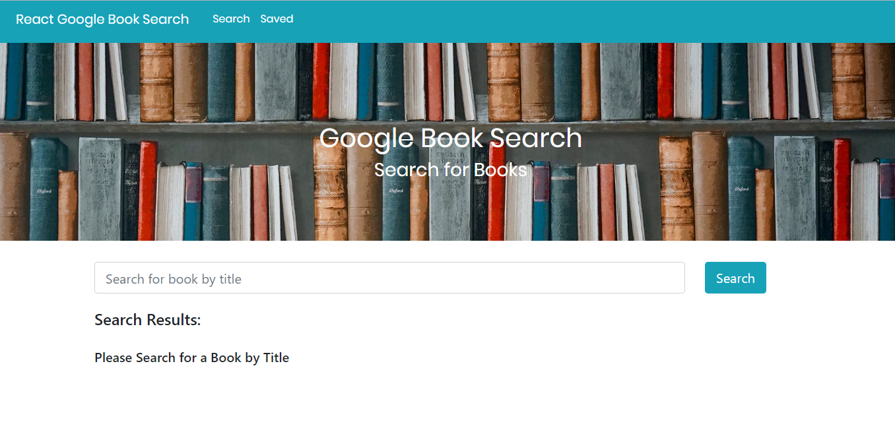
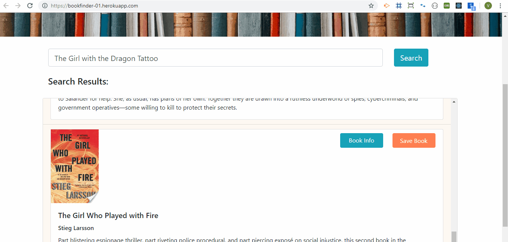
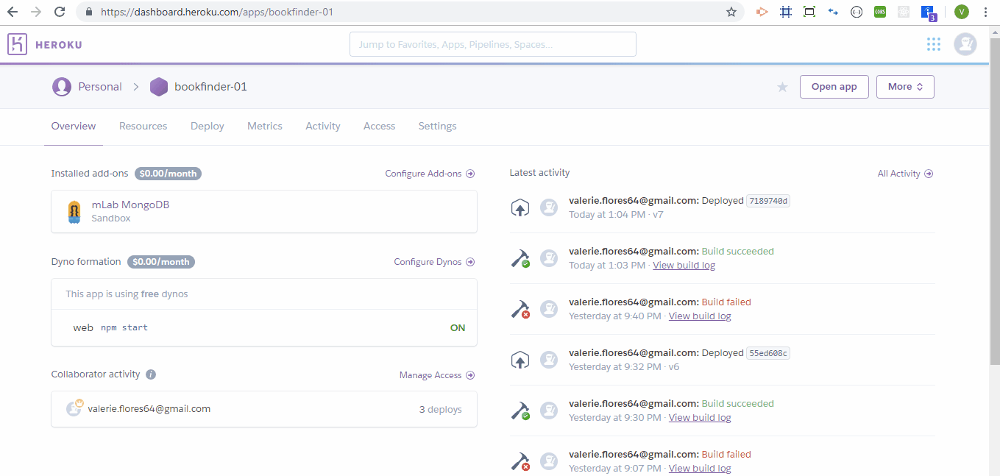

# Book-Finder

This is an on-line app that allows users to look up book information retrieved from Google Books API.

Once books populate (limited to 10 results), users may check out the book's information by clicking the button to the book's link, or they may save the book to their Saved page. If they would like to remove the book, they may click the "Remove" button on the Saved books page.

## Getting Started
To visit my site, open the link [here](https://bookfinder-01.herokuapp.com/). Navigation buttons have been added to the top left-hand side of the page.

## Prerequisites
Google Chrome is recommended for running this program.  If the user has pulled the app from the GitHub repository, please remember to `npm install` in the terminal, then enter the command `yarn start` to run this app.

## Challenges
This entire project was challenging.  The first challenge: retrieve books from the Google Books API.  Since this app is broken into several files in order to create more flexible code, ensuring that the files were properly linked and the query was correctly expressed took some time.

Connecting to the MongoDB database also proved to be challenging, again, ensuring that the retrieved information was stated properly in order for the database to recognize the data.

Since the design of this app is to save only books that the user wants to save, and not every book that is returned from the API, working the code so that it would drill down to an individual book, then determining how to save it to the database was challenging.

Once the book was saved, another challenge was determining how to render the saved books onto the Saved page, then how to delete unwanted books from the Saved book list (turns out, simply including the _id of the book on the onClick function would have saved a lot of time...).

NOTE:  Since mongoose saves each book with a unique _id, it is possible to save the same book more than once.  Updated versions of this code will include more parameters to exclude duplicate books appearing on the Saved book list.  Another issue is with the Google Books API - the path to add an image is `data.volumeInfo.infoLink.thumbnail`.  This is the same for all books from the API, however, some of the titles do not recognize this and will cause the app to time out (an error message appears when in Developer view).

## Built With
This is a MERN app built with:
* Express - Node package used to set up server (`npm i express`)
* Mongoose - Node package used for easier setup of MongoDB database (`npm i mongoose`)
* Axios - Node package used, along with Cheerio, to scrape information from a database and save is as a JSON object for developer use (`npm i axios`)
* React.js
* Node.js
* Bootstrap - CSS library used for easier styling
* Google Books API

## Authors
Valerie Flores - Initial work

## License
This project is licensed under the MIT License - see the LICENSE.md file for details

## Acknowledgments
Thank you to UCI Coding Bootcamp classmates, instructor, and TA's for your help and suggestions and the many examples of other coders online.